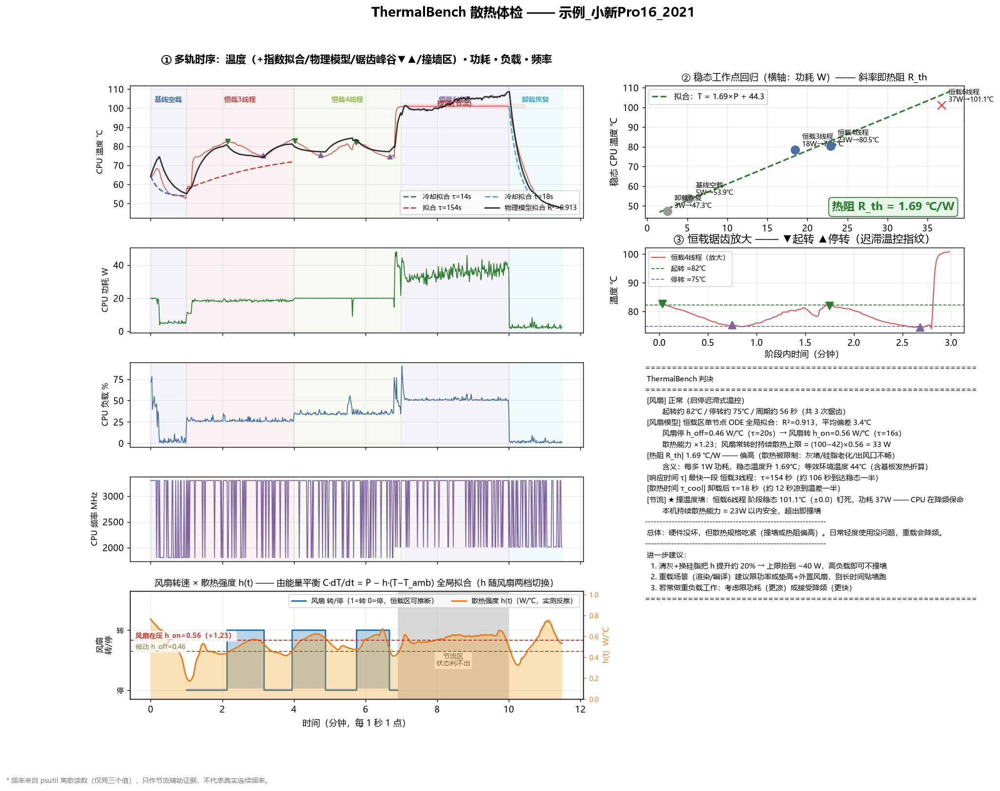
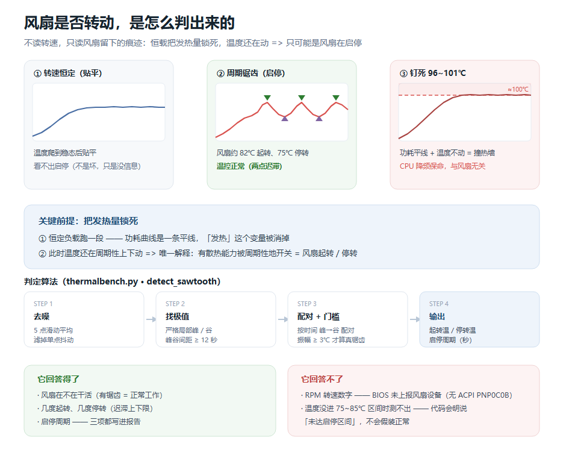
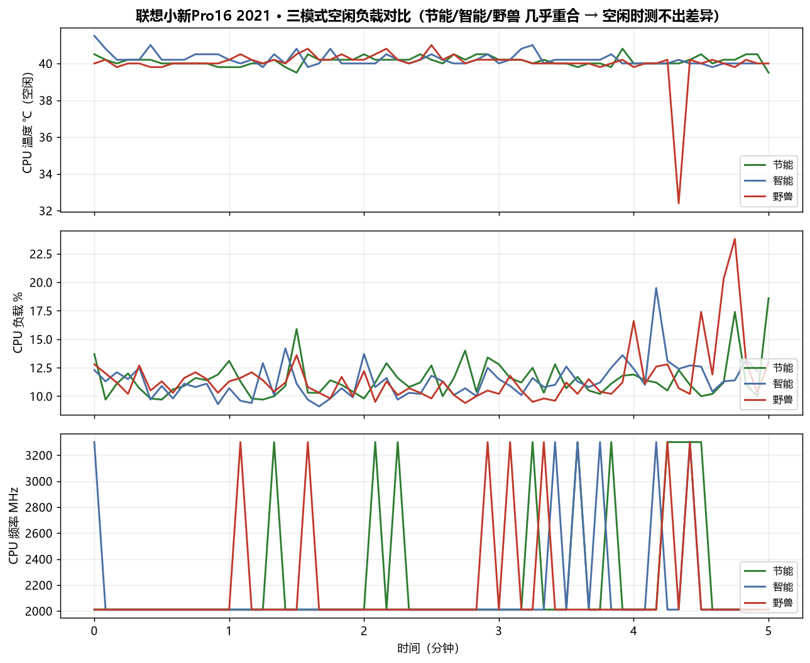

# ThermalBench —— 电脑散热体检（开源工具）

> 给电脑做一次「体检」，用**曲线拟合**把散热系统压缩成两个看得懂的数字，
> 再自动告诉你：**风扇正常吗？散热够用吗？撞温度墙了吗？该清灰吗？**



📄 [快速开始](#快速开始) · [FAQ](docs/常见问题FAQ.md) · [更新日志](CHANGELOG.md) ·
[贡献指南](CONTRIBUTING.md) · [AI提示词生成报告网页](AI提示词_生成报告网页.md) ·
[小白版示例网页](docs/示例报告网页.html)

## 为什么是这两个数字

空载温度、跑分温度都是「表象」，会随环境/后台负载漂移。真正刻画散热系统的是
两条拟合曲线的参数：

| 数字 | 拟合来源 | 直观含义 |
|---|---|---|
| **热阻 R_th (℃/W)** | 稳态温度 ~ 稳态功耗 线性回归的斜率 | 每多 1W 功耗，温度涨几度。**越低越强** |
| **时间常数 τ (秒)** | 加热/冷却段指数拟合 `T(t)=T∞±ΔT·e^(−t/τ)` | 温度走到稳态 63% 要多久。**越小响应越快** |

另外两样自动检测：

- **风扇行为**：自动分两条路——
  - **能读到转速**（CSV 里有 `风扇转速RPM` / `Fan RPM` 等列）→「**转速路**」：直接用实测转速，
    散热能力模型为「随转速连续变化 h = h_base + k·转速」，报告转速区间/均值与「转速-温度关系」图；
  - **读不到转速**（多数笔记本 BIOS 不上报）→「**锯齿路**」：恒定负载下温度仍周期性波动 =
    风扇「起转→降温→停转→再起转」的两点迟滞温控，能读出起转/停转温度、周期与散热增益。
  两条路输出字段完全一致，工具自动选择，不用用户操心。
- **热节流（撞墙）**：负载恒定但温度钉死在 ≥95℃ 不动、频率被压 = CPU 在降频保命，
  散热能力已到规格上限。

## 快速开始

```bash
# 依赖（Windows）
pip install numpy matplotlib psutil pythonnet scipy
winget install LibreHardwareMonitor   # 温度读数依赖它的 dll

# 或者整包安装（装完直接用 thermalbench 命令）
pip install .

# 全流程体检（约 12 分钟，需管理员：右键「以管理员身份运行」终端）
python thermalbench.py run --label 我的电脑

# 快速体检（约 7 分钟）
python thermalbench.py run --quick

# 只分析已有的 CSV（本工具或同类工具产出的；报告默认生成在当前目录）
python thermalbench.py analyze 散热数据_我的电脑_xxx.csv

# 指定输出目录 / 自定义名称
python thermalbench.py analyze 散热数据_xxx.csv --outdir 报告输出 --label 我的电脑

# 没有数据？先用内置示例跑一遍看输出长什么样
python thermalbench.py demo

# 跑冒烟测试（不碰硬件、不需要管理员）
python tests/test_smoke.py
```

双击 `启动散热体检.bat` 可以自动提权并输入机器名（Python 路径自动探测）。

## 实验设计（为什么这么测）

```
空载基线 → 恒载2线程 → 恒载4线程 → 恒载6线程 → 卸载恢复
  90s         150s        150s        150s        150s
```

关键在「**恒定负载**」：负载一恒定，温度波动就只剩一个解释——风扇启停。
阶梯式加线程则让工作点铺开在功耗轴上，回归出的斜率（热阻）才可信。

## 风扇是怎么被判出来的

> ℹ️ **如果你的机器能直接读到风扇转速（RPM）**（部分游戏本 / 台式机 / 品牌机 BIOS 会上报），
> 那就直接用转速数据即可，**本节可以整节跳过**——下面的锯齿推断法是给「读不到转速」的机器兜底的。



一句话：**它不测风扇，测的是风扇存在过的痕迹。**

1. **锁死发热量** —— 恒载跑一段，功耗曲线是平线，「发热」这个变量被消掉；
2. **看温度形态** —— 此时温度还在周期性上下动，唯一的解释就是有散热能力被周期性开关，
   即 EC 的两点迟滞温控：到 ~82℃ 起转 → 掉到 ~75℃ 停转 → 再升回 82℃；
3. **算法**（`thermalbench.py` → `detect_sawtooth()`）：5 点滑动平均去噪 → 找严格局部极值
   （峰谷间距 ≥12s）→ 按时间峰谷配对 → **振幅 ≥3℃ 才算真锯齿** → 输出起转温 / 停转温 / 周期；
4. **交叉验证** —— 全程功耗平线、负载平线排除假锯齿；卸载瞬间的降温速率若远超被动散热，
   说明风扇确实在猛吹。

温度三种形态对应的结论：

| 形态 | 结论 |
|---|---|
| 爬到稳态后贴平 | 转速恒定，看不出启停（不是坏，只是没信息） |
| 周期性锯齿 | 风扇在启停 = **温控正常** |
| 钉死 96~101℃ 不动 | **撞热墙、CPU 在降频**（节流判定，与风扇无关） |

**边界（不装懂）**：只在温度落入启停区间（本机 ~75~85℃）时才有效；低温段风扇压根不转、
高温段一直满载，两种情况都没有锯齿，代码会明说「测不出」或「未达启停区间」，**不假装正常**。
若「≥85℃ 却一个锯齿都没有」，判决会反过来提示你摸出风口查风扇。

## 生成一份「小白也能看懂」的带图报告网页

跑完体检后，如果你想把这个结果做成一页**带图、讲人话**的报告网页（浅色卡片式、手机可看、
图片内嵌成单文件可直接转发），项目里备好了一段**现成的 AI 提示词**：

📄 [`AI提示词_生成报告网页.md`](AI提示词_生成报告网页.md)

用法：把提示词整段复制给任意 AI，再附上你的 `散热体检报告_*.txt` / `.csv` / `.png`，
它就会输出一份同款单文件 HTML。提示词里已经写好了排版禁忌（不许拿大表格塞长文字）、
小白类比写法，以及**风扇章节的分支处理**——机器能读到转速就直接画转速曲线，
读不到就只给结论、不展开间接推断原理。

## 判决标准（内置规则）

| 指标 | 优秀 | 正常 | 偏高 | 差 |
|---|---|---|---|---|
| 热阻 R_th | <1.0 ℃/W | 1.0~1.4 | 1.4~1.8 | ≥1.8（建议清灰换硅脂） |
| 风扇锯齿 | 恒载下检出 = 启停温控正常 | | 高温却检不出 = 摸出风口查风扇 | |
| 热节流 | 未出现 = 正常 | | 稳态钉死 ≥95℃ = 撞墙，报告持续散热上限 | |

判决与建议同时输出到屏幕、`散热体检报告_*.png` 和 `散热体检报告_*.txt`。

报告图为一张大图：

- **左列 · 多轨时序曲线**（共享时间轴、阶段底色对齐）：温度（叠加逐段指数拟合虚线、
  **单节点物理模型拟合线**、锯齿峰谷标记、撞墙区）→ 功耗 → 负载 → 频率 →
  **风扇 转/停 × 散热强度 h(t)**。负载恒定而温度仍起伏，一眼看出是风扇在启停。
- **右上 · 稳态工作点回归**：斜率即热阻 R_th。
- **右中 · 恒载锯齿放大**：起转/停转温度直接标出。
- **右下 · 判决与建议**。

### 风扇物理模型（风扇轨道怎么来的）

RPM 读不到，但散热强度可以**从能量平衡反推**。对整条曲线全局拟合一个单节点热模型：

```
C·dT/dt = P(t) − h·(T − T_amb)      h 随风扇「转/停」两档切换
```

拟合 4 个参数（C、T_amb、h_off、h_on），报告中给出：

| 量 | 含义 |
|---|---|
| h_off → h_on | 风扇停/转两档的散热系数（W/℃），比值 = 风扇增益 |
| τ_off / τ_on | 升温/降温时间常数（秒） |
| 持续散热上限 | (100℃ − T_amb) × h_on —— 风扇常转也压不住的功耗线 |

风扇「转/停」方块波按锯齿峰谷切割（温度掉头 = 风扇开关，无滞后）；
热节流钉死区温度失去信息，状态显示「判不出」，不装懂。
注意 C 与 h 同向缩放，**比值 h_on/h_off 与 τ 才是稳健量**（有效热容是单节点等效值）。

## 项目结构

```
ThermalBench/
├─ thermalbench.py                 入口（转发到 thermalbench 包，`python thermalbench.py run` 用法不变）
├─ thermalbench/                   核心包（v1.2 由单文件拆分）
│  ├─ __init__.py                  re-export（`import thermalbench as tb` 旧 API 不变）
│  ├─ config.py                    阈值默认值 / 机型预设 / JSON 合并
│  ├─ model.py                     CSV 解析、指数拟合、锯齿检测、风扇物理模型（转速路 / 锯齿路）
│  ├─ verdict.py                   判决与建议
│  ├─ analyze.py                   分析编排（读 CSV → 拟合 → 判决 → 出图/出文）
│  ├─ plot.py / report.py          报告图 / 报告文
│  ├─ sensors.py                   传感器读数 + 分级诊断（DLL 缺失 / 权限 / 无传感器）
│  ├─ experiment.py / loadgen.py / cli.py   实验流程 / 负载发生器 / 命令行
├─ 启动散热体检.bat                  双击自动提权（GBK+CRLF，.gitattributes 已保护）
├─ pyproject.toml                  pip install . 后可用 thermalbench 命令
├─ requirements.txt                依赖清单
├─ thermalbench_config.json        可选：阈值覆盖（没有就用默认）—— 见「配置」节
├─ AI提示词_生成报告网页.md           把体检结果一键做成小白版带图网页
├─ tests/
│  └─ test_smoke.py                冒烟测试（合成数据验转速路 + 实测数据回归）
├─ examples/
│  ├─ 小新Pro16_2021_恒载阶梯.csv     真实实测数据（锯齿路示例）
│  └─ 合成数据_带风扇转速_演示用.csv    合成数据（转速路示例，真值增益 ×1.71）
├─ docs/
│  ├─ 风扇判定原理.png/.svg          锯齿法原理图
│  ├─ 示例报告网页.html              小白版带图讲解网页成品
│  └─ 常见问题FAQ.md
├─ 示例报告/                        demo 命令产出的报告样例
├─ .github/workflows/ci.yml         冒烟测试 + demo 回归（可无硬件跑）
├─ CHANGELOG.md / CONTRIBUTING.md / LICENSE(MIT)
```

## 输出文件

```
散热数据_<标签>_<时间>.csv        原始数据（2 秒 1 点）
散热体检报告_<标签>_<时间>.png    报告大图（多轨时序+风扇轨道 / 热阻回归 / 锯齿放大 / 判决）
散热体检报告_<标签>_<时间>.txt    文字版判决（含风扇物理模型参数）
```

## 依赖

```
numpy >= 1.24
matplotlib >= 3.7
psutil >= 5.9
pythonnet >= 3.0     # Windows 上读温度用
scipy >= 1.10        # 可选：装了才有「风扇物理模型」轨道（否则该轨道自动跳过）
```

## 配置（v1.2 新增：阈值可调）

所有判定阈值（撞墙温度、热阻分级、风扇启停区间、锯齿检测等）默认值在
`thermalbench/config.py` 的 `DEFAULTS`；合并顺序为 **默认值 → 外部 JSON → 机型预设**。
可在项目根放一个 `thermalbench_config.json` 覆盖，无需改代码：

```json
{
  "global": { "throttle_temp": 100.0, "rth_normal": 1.2 },
  "models": { "y9000p": { "throttle_temp": 97.0 } }
}
```

- `global`：全局覆盖任意 `DEFAULTS` 键。
- `models`：按 label 子串匹配机型（如 label 含 "y9000p" 时生效），优先级最高。
- 代码内还内置了 `MODEL_PRESETS`（如 "小新pro16" → 撞墙 100℃），无需建 JSON 即可按机型校准。

## 已验证机型

- 联想小新 Pro 16 2021（R5 5600H / GTX 1650）：实测 R_th≈1.7 ℃/W，
  6 线程满载 36W 撞 101℃ 温度墙，风扇起转 ~82℃ / 停转 ~75℃ / 周期 ~56s。
- 转速路：合成数据（真值散热增益 ×1.71）反解出 ×1.72、R²=1.000、RMSE 0.12℃，
  见 `tests/test_smoke.py`。
- 理论上支持任何 Windows 机器（LHM 覆盖 Intel/AMD CPU 与主流 GPU）。
  欢迎提 PR 补充机型数据与阈值校准。

## 真实数据示例（联想小新 Pro 16 2021）

下面是本项目在真实笔记本上产出的示例：

**① 恒载阶梯散热体检报告**（数据源：`examples/小新Pro16_2021_恒载阶梯.csv`，跑的是标准 空载→恒载阶梯→卸载 流程）：


**② 三模式（节能/智能/野兽）空闲负载对比**（模式对比实测，3 份数据取自同一台机器）：



> 说明：三模式是**空闲负载**对比，且数据里没有「CPU功耗」列，算不出热阻——
> 所以它不是散热体检报告，而是展示「三模式在空闲时几乎重合（测不出差异）」。
> 想真正体检散热（R_th / 撞墙 / 风扇），请跑 `run` 的恒载阶梯流程。

## 已知限制

- 温度/功耗必须**管理员权限**（LHM 走内核驱动），非管理员会拒绝运行。
- 风扇**转速（RPM）**：能读到就直接用（转速路）；多数联想家用本 BIOS 不向系统上报
  风扇设备（无 ACPI PNP0C0B），此时自动退回「恒载锯齿」间接判断，判决里会写明走的是哪条路。
- R_th 阈值按主流薄本经验标定，游戏本/台式机偏严格；样本越多会越准。
- `psutil.cpu_freq()` 在 Windows 上只吐离散假值，工具改用 LHM 逐核时钟，
  频率仅作节流辅助证据。

## License

MIT
